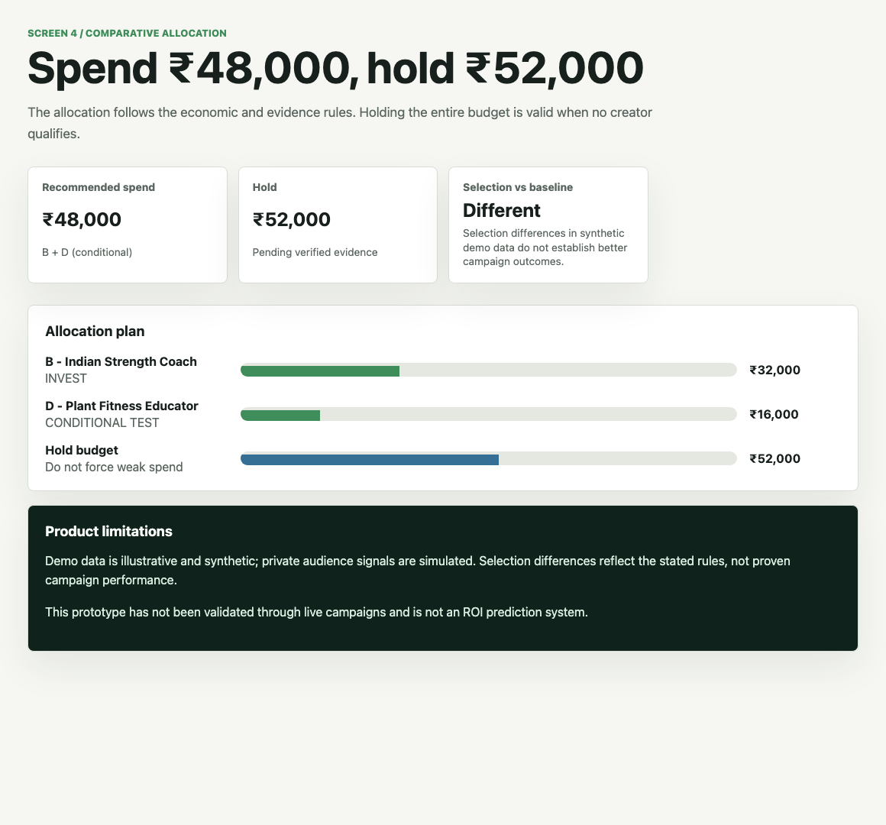
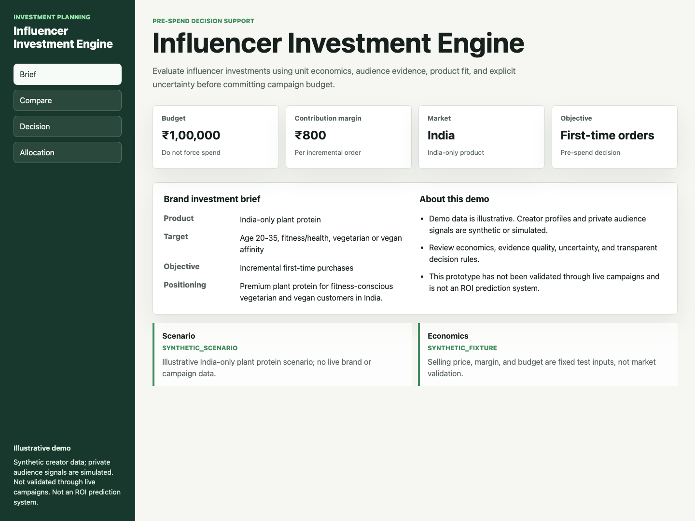
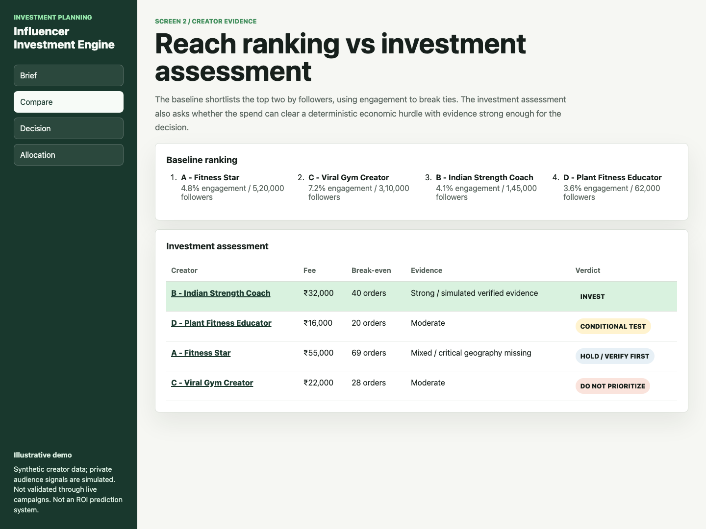
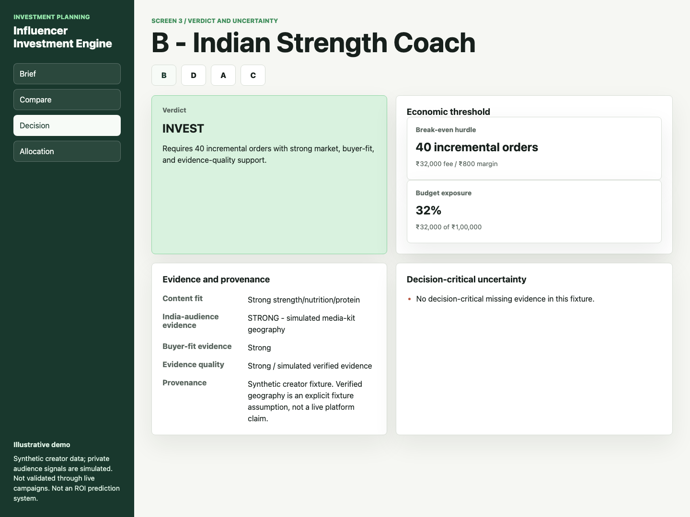
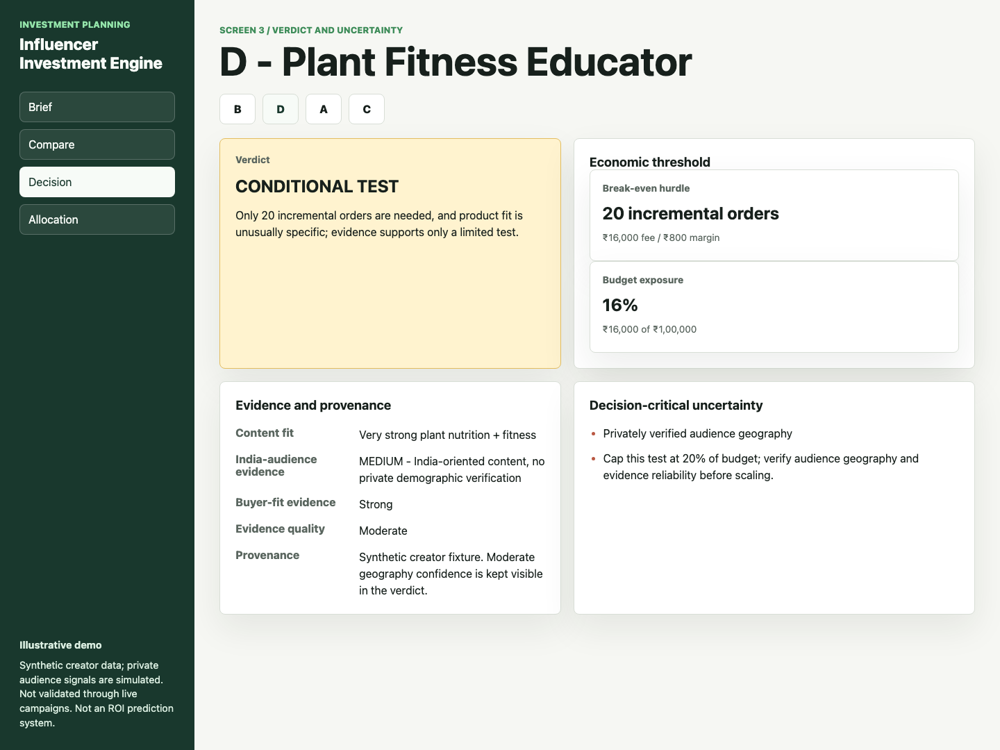
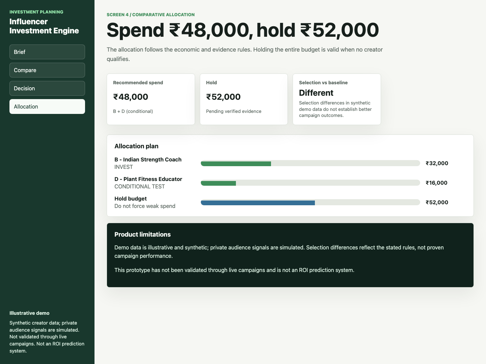

# Influencer Investment Engine

## You have ₹1,00,000. Which influencers deserve it?

You run a small direct-to-consumer (D2C) brand selling plant protein **only in India**. You have ₹1,00,000 for influencers, and each extra order contributes ₹800 toward recovering their fees.

**The demo’s answer: ₹32,000 invest in B + ₹16,000 conditional test in D + ₹52,000 held.** It recommends a plan before you spend; it does not execute payments or predict sales.

[**Try the live demo →**](https://charredfalcon98017.github.io/influencer-investment-engine/dist/) · [**Watch the 86-second recording →**](https://charredfalcon98017.github.io/influencer-investment-engine/assets/media/walkthrough.webm) · [Run locally](#try-it-yourself)

*Illustrative, fixed scenario. All creator data is synthetic; private audience evidence is simulated. No live-campaign validation or ROI prediction.*

## Why popularity can lead you astray

Creator A has **520K followers, 4.8% engagement and a ₹55,000 fee**. Creator C has the highest engagement, at **7.2%**. A reach-first shortlist picks A and C.

But can those followers buy your India-only product? A’s audience geography is unknown. C’s entertaining gym content is weak evidence of interest in premium plant protein. Likes and follower counts do not answer either question—and A needs **69 extra orders** just to cover the fee.

## What the engine changes

Instead of asking only “Who is popular?”, it asks **“What would this fee need to earn back, and is the evidence strong enough to risk the money?”** It combines audience evidence, product fit and the cost of breaking even, then explains an invest, conditional-test, hold or do-not-prioritize decision. Unspent budget is a valid result.



*Captured from the running app. The ₹48,000 recommended spend includes D’s conditional test; it is not an unconditional commitment.*

## Follow the decision

### 1. Brief — start with the business constraint

The product sells for ₹1,999, but **₹800 contribution per extra order** is what the demo uses to recover creator fees. The brief fixes the market, buyer and ₹1,00,000 budget before comparing creators.



### 2. Compare — a different shortlist, with reasons

The reach ranking puts **A and C** first. The investment assessment selects **B and D**, with D conditional. A different selection demonstrates the rules, not proven superior campaign performance.



### 3. Decision — see what supports the recommendation

**B: invest ₹32,000.** Its fee needs **40 incremental orders** to break even. In this illustrative dataset, B has strong India-audience evidence, buyer fit and nutrition content fit. Those evidence claims are simulated assumptions.



**D: conditional ₹16,000 test.** It needs **20 incremental orders** and exposes 16% of the budget. Strong plant-nutrition fit supports a small test, but audience geography is only moderately supported. **Verify geography and evidence reliability before scaling.**



### 4. Allocation — keep the money the evidence cannot justify

| Destination | Amount | Why |
| --- | ---: | --- |
| B — Indian Strength Coach | ₹32,000 | Meets the investment rules |
| D — Plant Fitness Educator | ₹16,000 | Qualifies only for a conditional test |
| Held budget | **₹52,000** | Do not force the rest into weak or missing evidence |

A is **hold / verify first**; C is **do not prioritize**. The engine does not divide the entire budget just because it is available.



[Watch the actual continuous screen recording](assets/media/walkthrough.webm) (about 86 seconds, silent): Brief → Compare → A’s missing evidence → B → D’s conditions → Allocation. [Playback notes](assets/media/README.md).

## Reasoning and methodology

**Break-even orders = `ceil(creator fee / contribution margin per incremental order)`.** This is the number of extra orders required to cover the fee, not a forecast of orders or profit.

Unknown geography or insufficient evidence blocks spending. Investment requires strong market evidence, evidence quality and buyer fit, strong content fit, and at most 45 break-even orders. A conditional test requires very strong content fit, strong buyer fit, at least medium market evidence and moderate evidence quality, at most 25 break-even orders, and at most 20% budget exposure. Rules apply in order; see the [full methodology](docs/methodology.md).

Allocation prioritizes investment before conditional tests, then lower break-even orders, with creator ID as a stable tie-breaker. Fees exceeding remaining budget are deferred. Holding the entire budget is valid. These thresholds are prototype policy assumptions, not empirically calibrated predictions; the allocation heuristic does not claim mathematical optimality.

## Limitations

- All creator identities, fees, follower counts, engagement, brand economics and fit assessments are **synthetic**. Private audience signals and media-kit verification are **simulated**; no platform or private analytics are accessed.
- No live campaigns have validated these recommendations. This is **not an ROI prediction system**; selection differences do not establish better outcomes.
- The demo is a **fixed scenario**: no input editing, creator discovery, accounts, campaign execution, payments or live integrations.
- The engine assumes unique creator IDs, positive finite budget and margin, and nonnegative finite fees. It is not hardened for arbitrary external input or production use.

## Try it yourself

[Open the hosted demo](https://charredfalcon98017.github.io/influencer-investment-engine/dist/) and follow **Brief → Compare → Decision → Allocation**. Select A, B, C or D on Decision to inspect the reasoning.

To run locally, clone this repository and serve its static app. Requires Python 3; no dependencies need installing.

```sh
git clone https://github.com/charredfalcon98017/influencer-investment-engine.git
cd influencer-investment-engine
python3 -m http.server 8765 --bind 127.0.0.1 --directory dist
```

Open [the local demo](http://127.0.0.1:8765). ES modules require HTTP; opening the HTML file directly is unsupported.

## Technical details

Vanilla JavaScript ES modules and CSS, with no backend or build dependencies. `src/engine.js` contains the decision rules, `src/fixtures.js` the sample data, and `src/app.js` the four-screen interface. `dist/` is the runnable static app. GitHub Pages serves the static files from this repository.

Checks require Node.js 18+ and npm:

```sh
npm run check
npm run qa
npm run qa:packaging
```

After editing source JavaScript, copy the changed files into `dist/`. Product QA checks exact source/distribution parity, the example and counterfactual behavior. See [product tests](docs/product-qa.md), [packaging verification](docs/packaging-qa.md) and the [media manifest](assets/media/README.md).
